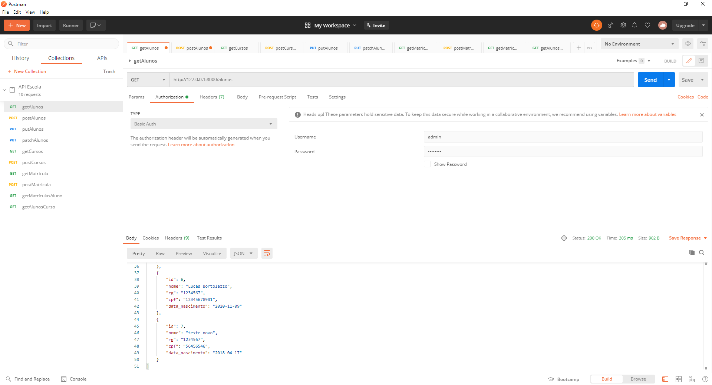

# API REST

API REST feita com python e Django Rest Framework. Desenvolvida por Lucas Bortolazzo, durante o curso de API com Django 3: Django Rest Framework feito na Alura.

## Features

1. Pesquisar, incluir, alterar e excluir alunos
2. Pesquisar, incluir, alterar e excluir cursos
3. Pesquisar, incluir, alterar e excluir matriculas
4. Pesquisar matriculas por aluno
5. Pesquisar alunos por curso
6. Autenticação

## Preview

### Index
 

### Métodos(Postman)
 

### Painel administrativo
 
 
## Main requirements

* Django==3.1.3
* djangorestframework==3.12.2
